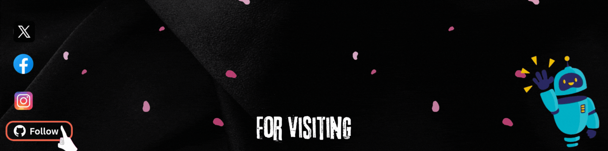

  

 

<!-- Founder+of+Kraftamine+%7C+Rozaa.in; -->

---

###  👨‍💻🎓 About Me

  <strong>
    I'm a passionate Full-Stack Developer, tech tinkerer, and lifelong learner from India 🇮🇳.
  </strong>

  
    I hold a Bachelor's degree in Computer Applications (<strong>BCA</strong>), and I'm currently pursuing my <strong>MCA</strong>. 
    My journey in tech started with curiosity and evolved into a deep love for building creative digital solutions that make a difference.
  

---

### ⚡ Frameworks & Platforms I Work With

#### Frameworks : 
  

#### Platforms :
  

---

### 💼 Platforms I Build For

  
  
  
  

---

### 💻 Tech Stack:

                                   

---

### 🚀 GitHub Stats

  
 

  

---

### 🔥 Contribution Graph

  

---

### 🌐 Connect with Me 

        

---

### 🎵 Coding Music Vibes

  

---

  

